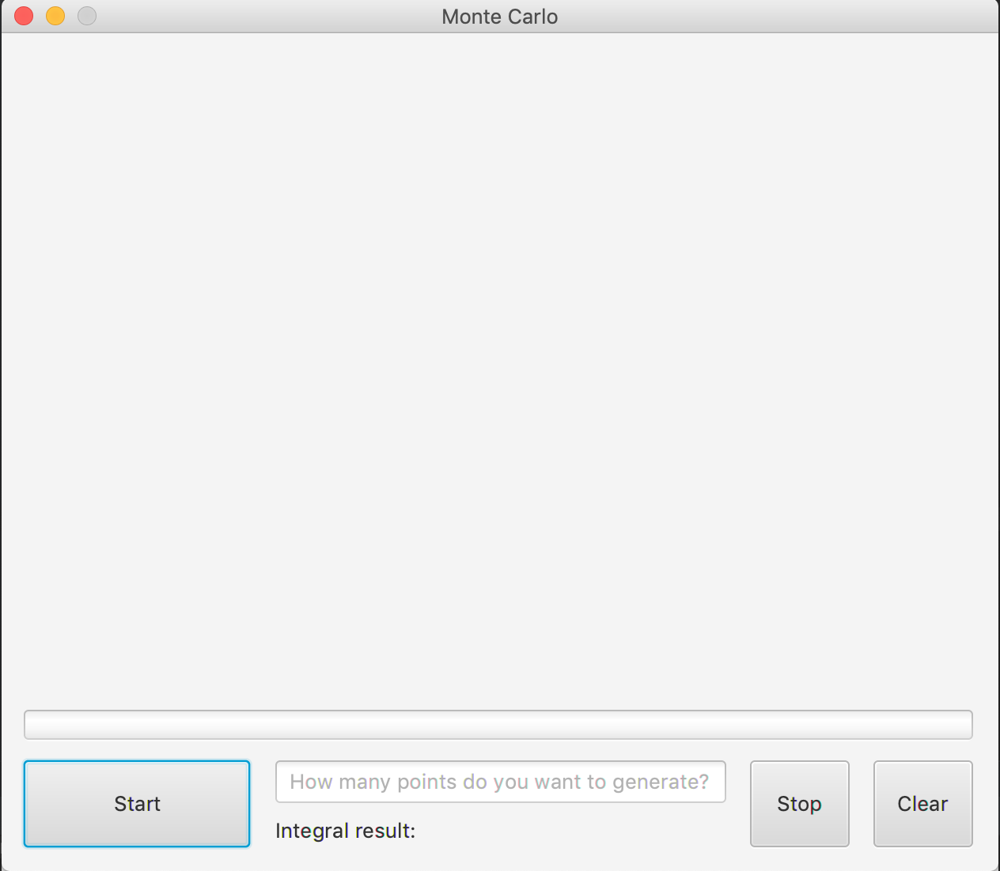
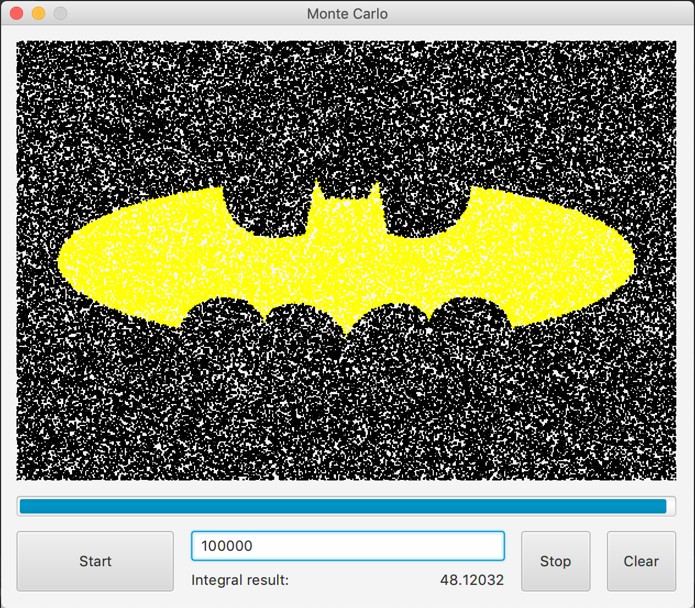
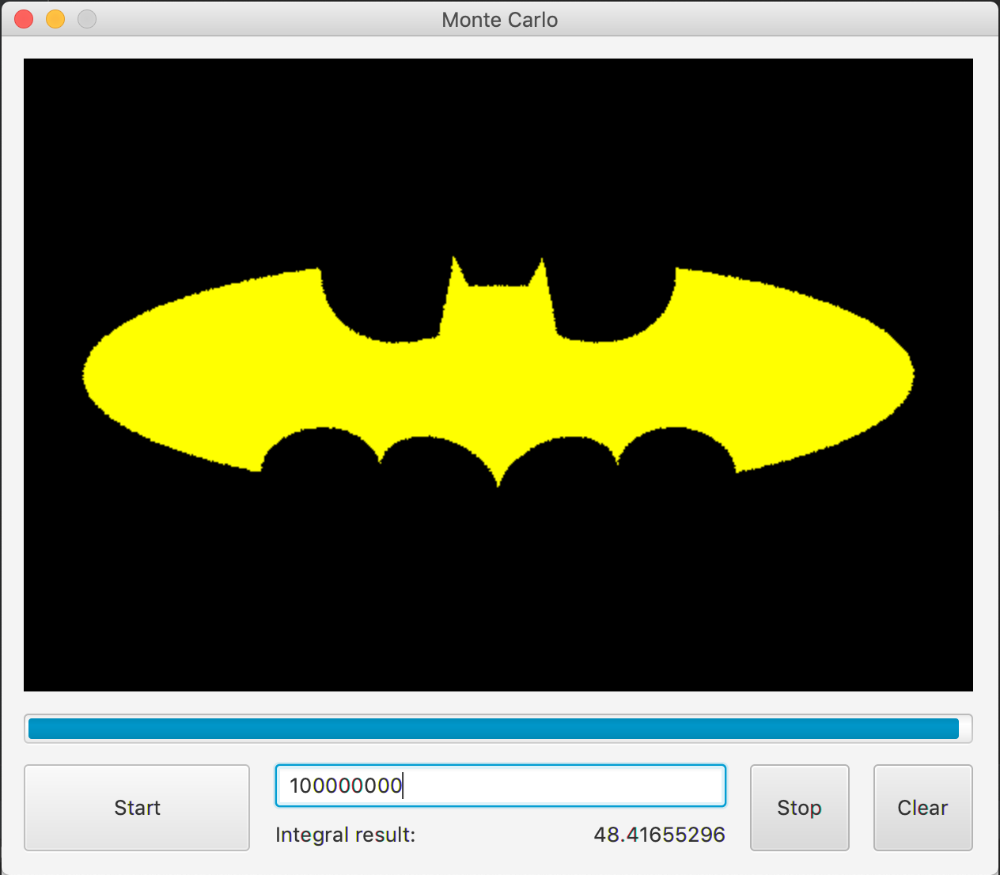

# Monte Carlo Calculator
Integral calculator which uses Monte Carlo method to calculate the result.\
App provides user with both result and its graphical representation on canvas.

Application graphical user interface.

Result for 100000 points.

Result for 100000000 points.
